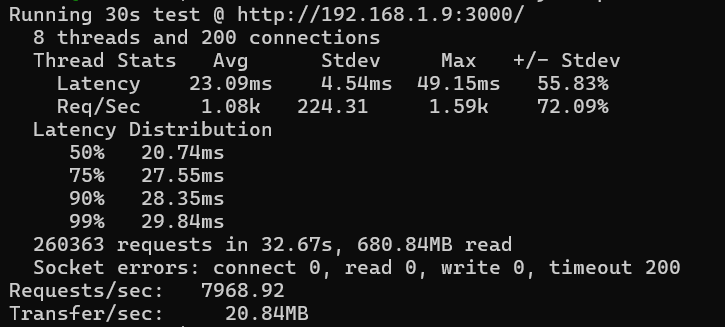

# 🚀 Adaptive C++ HTTP Server (from scratch)


"Instead of just writing APIs on top of servers like Nginx or Node.js, this project goes one level deeper — we built the **HTTP server itself, from scratch, in C++**."

It is lightweight, low-level, and designed to handle high concurrency with adaptive self-protection features.

---

## ✨ Key Features

- **Custom HTTP Server in C++**
  - Built using raw sockets and Windows **IOCP (I/O Completion Ports)**
  - Handles thousands of concurrent connections efficiently

- **Adaptive Rate Limiting (per client)**
  - Each client connection is monitored
  - Dynamic thresholds based on traffic statistics (`mu`, `variance`)
  - Prevents abuse or flooding while allowing normal traffic bursts

- **IP-Based Limiter**
  - Tracks IP addresses with their own adaptive state
  - Fair admission for multiple clients from same IP
  - Periodic eviction of stale IP entries

- **Overload Admission Control**
  - On `accept()`, if the server is overloaded:
    - Gracefully responds with **HTTP 429: Too Many Requests**
    - Closes the connection politely
  - Prevents the server from being overwhelmed

- **Hybrid Async Model**
  - **Async WSARecv** for efficient input handling
  - **Simplified Send()** for lightweight response writes
  - Balanced for CPU-friendliness and simplicity

- **Separation of Concerns**
  - Request parsing, connection handling, and rate limiting are modular
  - Easy to extend for future improvements (pipelining, full async WSASend, thread-pool tuning)

---

## ⚙️ Architecture Overview

1. **Connection Lifecycle**
   - Client connects → checked by **IPLimiter + admission control**
   - If accepted → request handled asynchronously with IOCP worker threads

2. **Adaptive Control Layers**
   - **Per-request adaptive limiter** (per client)
   - **IP-based limiter** (global across clients from same IP)
   - **Admission control at accept()** (reject excess load early)

3. **Concurrency Handling**
   - Uses Windows **IOCP threads** to scale with CPU cores
   - No external frameworks, minimal abstractions

---

## Flow


---

## 📊 Why is this Unique?

- Most developers never touch raw server internals — they just deploy APIs on existing frameworks.
- Here, the **entire HTTP server core** was implemented manually in **C++**, a low-level systems language.
- The design introduces **novel adaptive mechanisms** uncommon in scratch-built servers:
  - 🔹 Adaptive per-client rate limiter  
  - 🔹 IP-aware fairness to prevent abuse  
  - 🔹 Overload admission control with graceful rejection  

This isn’t just another “toy server” — it demonstrates how **production-grade concepts** (admission control, fairness, overload handling) can be built at the **raw systems level** while still offering an **Express.js-like developer experience**.

---

## 🚀 Future Improvements

This project takes a different route: we **built the web server itself** — from scratch, in pure **C++**.

- Full producer-consumer scheduling with smart request pipelines
- Fully async **WSASend**
- Self-tuning worker thread pool
- Advanced congestion control (dynamic backlog admission)
- Smart request scheduling, priortizing over fast GET requests than POST requests

---

## 🛠️ Tech Stack

- **Language:** C++20
- **Concurrency Model:** IOCP (Windows I/O Completion Ports)  
- **Networking:** Winsock2 APIs (WSASocket, WSARecv, Send)  
- **Build System:** CMake  

---

## 📦 Getting Started

Note: It will work in windows only, and it will need C++20 version with windows API. You don't need to do anything, just get mingw latest compiler from winlibs.com.

```bash
git clone https://github.com/SrabanMondal/adaptive-cpp-http-server.git
cd adaptive-cpp-http-server
mkdir build && cd build
cmake ..
cmake --build .
```

---

## Run the server

```bash
cd ..
/build/adaptive-cpp-http-server.exe
```

Server starts on default port 3000. But you can change it in main.cpp.
Try with:

```bash
curl http://localhost:3000/
```

---

## 🎯 Developer-Friendly API (Express.js Style)

This server isn’t just sockets and bytes — it comes with a **clean, high-level API** inspired by popular web frameworks like **Express.js**.

Example: define routes in a few lines:

```cpp
Router router;
Server server(3000, router);

// Simple HTML route
router.addRoute("/", HttpMethod::GET, [](const HttpRequest& req) {
    return HtmlResponse("<h1>Hello from C++ HTTP server!</h1>");
});

// Serve binary data
router.addRoute("/favicon.ico", HttpMethod::GET, [&](const HttpRequest& req) {
    std::vector<char> data = ft.readBinaryFile("favicon.ico");
    return BinaryResponse(data, "image/x-icon", 200);
});

// Return JSON
router.addRoute("/getData", HttpMethod::GET, [](const HttpRequest& req) {
    std::string json = R"({"name":"C++ server","version":0.1})";
    return JsonResponse(json);
});

// Handle POST with JSON body
router.addRoute("/putData", HttpMethod::POST, [](const HttpRequest& req) {
    if (req.contentType != "application/json")
        return JsonResponse(R"({"message":"Need Json body"})", 400);

    auto bodyOpt = req.parseJsonBody();
    if (!bodyOpt) return JsonResponse(R"({"message":"Bad JSON"})", 400);

    json body = *bodyOpt;
    std::string name = body.value("name", "");
    return JsonResponse(R"({"message":"Name received )" + name + "\"}");
});
```

---

## 🚀 Why this matters

- Plug-and-play routes → Add GET, POST, PUT, DELETE handlers with just lambdas.

- Multiple response types → JSON, HTML, text, binary.

- Extendable → CORS, middleware, authentication, DB integration can be added on top easily.

- Scalable abstraction → Beginner-friendly for API devs, yet built on low-level IOCP for performance.

## 📊 Benchmarks

The server was benchmarked with wrk to measure raw throughput.

### Environment

- OS: Windows 11
- CPU: Intel i5-12400, 16 GB RAM
- Build: C++ (MinGW), Windows IOCP

### Command

```bash
wrk -t8 -c200 -d30s http://127.0.0.1:3000/
```

Here’s a sample wrk benchmark run:



### Result (baseline, blocking send, no separation of concerns)

**⚡ ~8000 requests/sec sustained**
Keep-alive connections enabled

Even with a blocking send and no dedicated send pipeline,
the server already achieves ~8.5k requests/sec on Windows IOCP.
With non-blocking WSASend + zero-copy (TransmitFile), much higher throughput is expected.


## 🤝 Contributing

Contributions, issues, and feature requests are welcome!
Feel free to fork the repo and submit a PR.

## 📜 License

MIT License © 2025 Sraban Mondal

This project bridges the gap between low-level systems programming and high-level web development.
