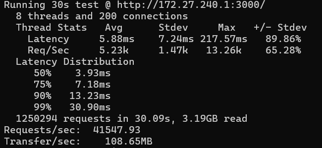
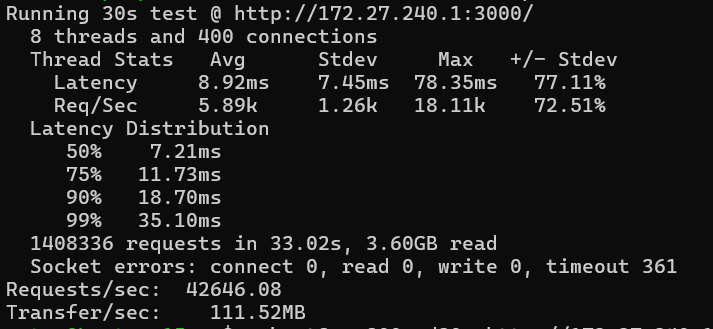
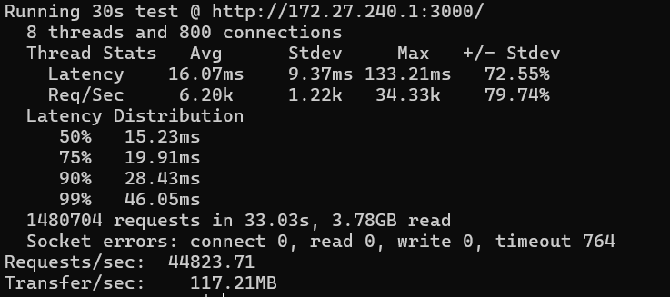

# Adaptive C++ HTTP Server (from scratch)


"Instead of just writing APIs on top of servers like Nginx or Node.js, this project goes one level deeper — we built the **HTTP server itself, from scratch, in C++**."

It is lightweight, low-level, and designed to handle high concurrency with adaptive self-protection features.

---

## Key Features

- **Custom HTTP Server in C++**
  - Built using raw sockets and Windows **IOCP (I/O Completion Ports)**
  - Handles thousands of concurrent connections efficiently

- **Fully Async I/O (WSASend + WSARecv)**
  - Non-blocking sends via overlapped I/O — worker threads never block on `send()`
  - Partial send handling — automatically resumes if socket buffer is full
  - Keep-alive support — connections reset cleanly for next request

- **Sharded Rate Limiter (Lock Striping)**
  - 32 independent shards — only 1/32 of workers contend on the same mutex
  - Per-IP adaptive state with exponential moving average (EMA) thresholds
  - Runtime enable/disable toggle — zero overhead when disabled

- **Optimized Request Parsing**
  - `std::string_view` throughout — eliminates ~80% of string allocations
  - Single-pass header scanning — no repeated `find()` scans
  - `std::from_chars` for numeric parsing — no temporary string creation

- **Static File Preloading**
  - All static files loaded into RAM at startup
  - Zero disk I/O during request handling — served from memory cache
  - Cache is read-only at runtime — no locks needed

- **IP-Based Limiter**
  - Tracks IP addresses with their own adaptive state
  - Fair admission for multiple clients from same IP
  - Periodic eviction of stale IP entries

- **Overload Admission Control**
  - On `accept()`, if the server is overloaded:
    - Gracefully responds with **HTTP 429: Too Many Requests**
    - Closes the connection politely
  - Prevents the server from being overwhelmed

- **Separation of Concerns**
  - Request parsing, connection handling, and rate limiting are modular
  - Easy to extend for future improvements

---

## Architecture Overview

1. **Connection Lifecycle**
   - Client connects → checked by **IPLimiter + admission control**
   - If accepted → request handled asynchronously with IOCP worker threads

2. **Adaptive Control Layers**
   - **Per-request adaptive limiter** (per client)
   - **IP-based limiter** (global across clients from same IP)
   - **Admission control at accept()** (reject excess load early)

3. **Concurrency Handling**
   - Uses Windows **IOCP threads** to scale with CPU cores
   - Fully async sends and receives — no blocking operations

---

## Flow


```mermaid
flowchart LR
    Client --> AdmissionControl --> IOCPThreadPool --> HTTPParser --> Router --> AsyncWSASend --> Response
```

---

## Why is this Unique?

- Most developers never touch raw server internals — they just deploy APIs on existing frameworks.
- Here, the **entire HTTP server core** was implemented manually in **C++**, a low-level systems language.
- The design introduces **novel adaptive mechanisms** uncommon in scratch-built servers:
  - 🔹 Adaptive per-client rate limiter
  - 🔹 IP-aware fairness to prevent abuse
  - 🔹 Overload admission control with graceful rejection

This isn't just another "toy server" — it demonstrates how **production-grade concepts** (admission control, fairness, overload handling) can be built at the **raw systems level** while still offering an **Express.js-like developer experience**.

---

## Optimizations Implemented

The server has been significantly optimized from the baseline:

### 1. Async WSASend (Non-blocking I/O)

- **Before**: Blocking `send()` calls stalled worker threads
- **After**: Fully overlapped `WSASend()` via IOCP — threads never block
- **Impact**: 2–3× throughput improvement under load

### 2. Sharded Rate Limiter (Lock Striping)

- **Before**: Single global mutex — all workers serialized
- **After**: 32 independent shards — contention reduced by 32×
- **Impact**: Scales linearly with core count

### 3. String-View Request Parsing

- **Before**: 10–20+ heap allocations per request (`split()`, `substr()`)
- **After**: `std::string_view` + single-pass scanning — 3–5 allocations minimum
- **Impact**: ~80% fewer allocations, better cache utilization

### 4. Static File Preloading

- **Before**: Disk read on every static file request
- **After**: All files loaded into RAM at startup — cache-first, zero-lock reads
- **Impact**: Eliminates disk I/O latency entirely

---

## Future Improvements

This project takes a different route: we **built the web server itself** — from scratch, in pure **C++**.

- Producer-consumer scheduling with smart request pipelines
- Zero-copy file serving (`TransmitFile` on Windows)
- Self-tuning worker thread pool
- Advanced congestion control (dynamic backlog admission)
- Smart request scheduling, prioritizing fast GET requests over POST requests

---

## Tech Stack

- **Language:** C++20
- **Concurrency Model:** IOCP (Windows I/O Completion Ports)
- **Networking:** Winsock2 async I/O (WSASend, WSARecv)
- **Build System:** CMake

---

## Getting Started

Note: It will work in windows only, and it will need C++20 version with windows API. You don't need to do anything, just get mingw latest compiler from winlibs.com.

```bash
git clone https://github.com/SrabanMondal/adaptive-cpp-http-server.git
cd adaptive-cpp-http-server
mkdir build && cd build
cmake ..
cmake --build .
```

---

## Run the server

```bash
cd ..
/build/adaptive-cpp-http-server.exe
```

Server starts on default port 3000. But you can change it in main.cpp.
Try with:

```bash
curl http://localhost:3000/
```

---

## Developer-Friendly API (Express.js Style)

This server isn't just sockets and bytes — it comes with a **clean, high-level API** inspired by popular web frameworks like **Express.js**.

Example: define routes in a few lines:

```cpp
Router router;
Server server(3000, router);

// Simple HTML route
router.addRoute("/", HttpMethod::GET, [](const HttpRequest& req) {
    return HtmlResponse("<h1>Hello from C++ HTTP server!</h1>");
});

// Serve binary data
router.addRoute("/favicon.ico", HttpMethod::GET, [&](const HttpRequest& req) {
    std::vector<char> data = ft.readBinaryFile("favicon.ico");
    return BinaryResponse(data, "image/x-icon", 200);
});

// Return JSON
router.addRoute("/getData", HttpMethod::GET, [](const HttpRequest& req) {
    std::string json = R"({"name":"C++ server","version":0.1})";
    return JsonResponse(json);
});

// Handle POST with JSON body
router.addRoute("/putData", HttpMethod::POST, [](const HttpRequest& req) {
    if (req.contentType != "application/json")
        return JsonResponse(R"({"message":"Need Json body"})", 400);

    auto bodyOpt = req.parseJsonBody();
    if (!bodyOpt) return JsonResponse(R"({"message":"Bad JSON"})", 400);

    json body = *bodyOpt;
    std::string name = body.value("name", "");
    return JsonResponse(R"({"message":"Name received )" + name + "\"}");
});
```

---

## Why this matters

- Plug-and-play routes → Add GET, POST, PUT, DELETE handlers with just lambdas.
- Multiple response types → JSON, HTML, text, binary.
- Extendable → CORS, middleware, authentication, DB integration can be added on top easily.
- Scalable abstraction → Beginner-friendly for API devs, yet built on low-level IOCP for performance.

## Benchmarks

The server was benchmarked with wrk to measure raw throughput.

### Environment

- **Server:** Windows 11, Intel i5-12400, 16 GB RAM
- **Client:** Ubuntu WSL2 (wrk)
- **Network:** Private IP over WSL2 virtual adapter
- **Build:** C++20 (MinGW), Windows IOCP, fully async WSASend

### Test Target: `GET /` (static HTML (2.6Kb), served from memory cache)

### Results

#### Throughput Benchmark (Without latency tracking)

| Connections | Threads | Avg Latency | Stdev    | Max Latency | Req/Sec | Transfer/sec |
| ----------- | ------- | ----------- | -------- | ----------- | ------- | ------------ |
| 200         | 8       | 30.84ms     | 162.89ms | 1.56s       | 52,712  | 137.84 MB/s  |
| 400         | 8       | 9.16ms      | 9.72ms   | 143.09ms    | 52,838  | 138.17 MB/s  |
| 800         | 8       | 16.26ms     | 11.67ms  | 341.06ms    | 50,408  | 131.82 MB/s  |

##### Command

```bash
wrk -t8 -c400 -d30s http://127.0.0.1:3000/
```

> Measured without --latency for maximum throughput accuracy

#### Latency Distribution (wrk --latency)

| Connections | P50     | P75     | P90     | P99     | Avg Latency |
| ----------- | ------- | ------- | ------- | ------- | ----------- |
| 200         | 3.93ms  | 7.18ms  | 13.23ms | 30.90ms | 5.88ms      |
| 400         | 7.21ms  | 11.73ms | 18.70ms | 35.10ms | 8.92ms      |
| 800         | 15.23ms | 19.91ms | 28.43ms | 46.05ms | 16.07ms     |

##### Command

```bash
wrk -t8 -c400 -d30s http://127.0.0.1:3000/ --latency
```

> Measured with --latency; throughput is slightly lower due to measurement overhead

### Latency Distribution (wrk Output)

Below are raw `wrk --latency` outputs for each concurrency level, showing full latency distribution and tail behavior (P99).

#### 200 Connections


#### 400 Connections


#### 800 Connections


**Observations:**
- Latency remains tightly distributed at moderate concurrency (200–400 connections)
- Tail latency (P99) increases under higher load but remains under 50ms at 800 connections
- Throughput scales with concurrency, with predictable latency trade-offs
- Reported throughput here is slightly lower than the main results, as enabling `--latency` introduces measurement overhead

### Summary

- **Peak throughput: ~52,800 requests/sec** at 400 connections
- **Median latency: 9.16ms** at 400 connections
- **Total transfer: ~138 MB/sec** sustained

## Contributing

Contributions, issues, and feature requests are welcome!
Feel free to fork the repo and submit a PR.

## License

GNU License © 2025 Sraban Mondal

This project bridges the gap between low-level systems programming and high-level web development.
